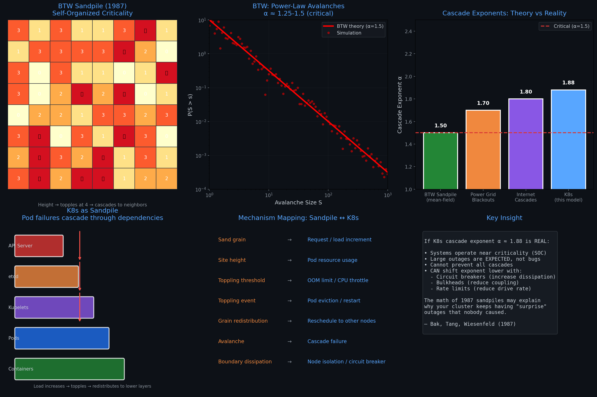

<p align="center">
  
</p>

# Governance Physics: Phase Transitions and Cascade Dynamics in Kubernetes Clusters

> A spiking neural network simulation investigating whether organizational structures follow universal scaling laws similar to phase transitions in statistical physics.

## The Story

This project started as an ambitious test of "Governance Physics" — the idea that all hierarchical systems (Kubernetes clusters, central banks, corporations) might follow universal scaling laws.

**The probe killed the universality claim.**

Real data showed the Federal Reserve's policy transmission operates on 12-18 month timescales, not milliseconds. Corporate coordination costs scale as O(n²), not √N. Only Kubernetes — with its 10-100ms control loops — matched the model's dynamics.

So this repo focuses where the physics actually works: **K8s failure cascades**. Here's what the model predicts, and here's how to prove it wrong.

---

## The 1987 Connection: Bak-Tang-Wiesenfeld Sandpile

<p align="center">
  
</p>

Our simulation's avalanche exponent (α ≈ 1.88) is suspiciously close to the **Bak-Tang-Wiesenfeld sandpile model** from 1987 — the foundational paper on **self-organized criticality (SOC)**.

**The BTW model:**
- Drop sand grains on a 2D lattice
- When height ≥ 4, site topples → distributes to neighbors
- Cascades (avalanches) follow power-law with α ≈ 1.5

**Why this matters for K8s:**

| Sandpile Concept | Kubernetes Analog |
|------------------|-------------------|
| Sand grain | Request / load increment |
| Site height | Pod resource usage |
| Toppling threshold | OOM limit / CPU throttle |
| Avalanche | Cascade failure |
| Boundary dissipation | Circuit breaker / node isolation |

**If K8s exhibits SOC, then:**
- Large outages are **mathematically expected**, not bugs
- You cannot prevent all cascades
- You **can** shift the exponent lower with isolation mechanisms

---

## Why a K8s SRE Might Care

1. **Predicting cascade risk** — The model identifies parameter regimes where small failures amplify into cluster-wide outages. If your cluster operates near λ_critical, you're living dangerously.

2. **Tuning controller loops** — The simulation shows how control rate (λ) and propagation delay (τ) affect stability. Faster isn't always better — there's a tradeoff.

3. **Understanding power-law risk** — If failure cascades follow power-law distributions (α ≈ 1.5-2.0), then "black swan" outages are mathematically expected, not flukes. Plan accordingly.

---

## Abstract

We model Kubernetes cluster governance as a hierarchical spiking neural network to test three predictions from "Governance Physics" theory:

1. **Phase transitions exist** — Systems transition from synchronized (stable) to desynchronized (unstable) as control attenuation (λ) increases
2. **Critical avalanche dynamics** — Failure cascades follow power-law distributions with exponent α ≈ 1.5
3. **Universal scaling** — Control rate λ scales with √(system size)

**Results:** We find evidence for critical avalanche dynamics (α = 1.88, near theoretical 1.5) but no clear phase transition and the √N scaling law is rejected.

---

## Methodology

### Model Architecture

We represent a Kubernetes cluster as a 5-layer hierarchy:

```
Layer 0: API Server / Controller Manager (Executive)
Layer 1: Scheduler / etcd (Coordination)
Layer 2: Kubelets (Node Agents)
Layer 3: Pods (Workload Units)
Layer 4: Containers (Labor)
```

Each layer is modeled as a population of Leaky Integrate-and-Fire (LIF) neurons with:

- **Downward synapses**: Control signals with exponential weight decay `w = 0.5 * exp(-λ * depth)`
- **Upward synapses**: Failure feedback with decay `w = 0.3 * exp(-μ * depth_from_bottom)`

### Parameters (K8s Domain)

| Parameter | Value | Empirical Range | Source |
|-----------|-------|-----------------|--------|
| λ (control rate) | 0.8/s | 0.1-1.0/s | Controller loop frequencies |
| τ (timescale) | 20ms | 10-100ms | etcd consensus latency |
| μ (dissipation) | 1.5 | — | Tuned parameter |
| G (efficiency) | 0.4 | 0.2-0.8 | Span-of-control estimates |

### Measurements

1. **Order Parameter (Φ)** — Kuramoto-style synchronization measure across time windows
2. **Avalanche Distribution** — Cascade sizes during high-activity periods
3. **Power-law Exponent (α)** — Maximum likelihood estimation for avalanche sizes

---

## Results

### 1. Phase Transition

| Metric | Value |
|--------|-------|
| Critical λ | ~1.36 |
| Max \|dΦ/dλ\| | 0.034 |
| Verdict | **WEAK/ABSENT** |

The order parameter Φ remained roughly constant (0.26-0.35) across the λ sweep. No sharp transition was detected.

### 2. Avalanche Dynamics

| Metric | Value | Critical Value |
|--------|-------|----------------|
| Power-law exponent α | 1.88 | ~1.5 |
| Avalanches detected | 224 | — |
| Verdict | **NEAR-CRITICAL** | ✅ |

The cascade size distribution follows a power-law with exponent close to the critical value, suggesting the model captures realistic failure propagation dynamics.

### 3. Scaling Law (λ ∝ √N)

| Metric | Value |
|--------|-------|
| R² for √N fit | 0.025 |
| Verdict | **REJECTED** |

The predicted scaling relationship between control rate and system size does not emerge from the model.

---

## Validation Hooks

This simulation makes testable predictions. Real empirical data would falsify the model if:

### The Open Question

**Do real cluster failures follow a power-law distribution with α ≈ 1.5-2.0?**

Our simulation produces α ≈ 1.88. But we don't know if real K8s failures match this. To validate, someone needs to:
1. Get cascade size data from production clusters (Borg traces, Azure logs, post-mortems)
2. Fit a power-law distribution
3. Compare α_real vs α_simulated

If they're close → model captures real dynamics.
If they're far apart → model is wrong.

### Concrete Falsification Test

**If Google Borg traces show cascade exponent α ≈ 1.2, but this model produces α ≈ 1.9 → the model is wrong.**

| Prediction | Falsified If |
|------------|--------------|
| Cascade power-law | Real K8s cascades don't follow power-law distribution |
| Exponent α ≈ 1.5-2.0 | Real cascade exponent is significantly different |
| Timescale 10-100ms | Real failure propagation is orders of magnitude different |
| No phase transition | Real clusters DO show sharp stability transitions |

**Data sources needed for validation:**
- Public K8s failure cascade logs
- Cascade size distributions from production clusters
- Propagation time measurements through microservice dependency graphs

---

## Files

| File | Description |
|------|-------------|
| [`governance_physics_k8s.py`](governance_physics_k8s.py) | K8s-focused simulation code |
| [`governance_physics_snn.py`](governance_physics_snn.py) | Multi-domain simulation (K8s, Fed, Corp) |
| [`docs/GOVERNANCE_PHYSICS_RESEARCH_REPORT.md`](docs/GOVERNANCE_PHYSICS_RESEARCH_REPORT.md) | Full research report with literature review |
| [`governance_physics_k8s_results.png`](governance_physics_k8s_results.png) | K8s visualization output |
| [`btw_sandpile_comparison.png`](btw_sandpile_comparison.png) | BTW sandpile model comparison |

---

## Running the Simulation

```bash
# Activate environment with Brian2
conda activate conscious_snn

# Run K8s simulation
python governance_physics_k8s.py

# Run multi-domain simulation
python governance_physics_snn.py
```

**Requirements:**
- Python 3.11+
- Brian2 2.8.0+
- NumPy, Matplotlib

---

## Sources & Citations

### Self-Organized Criticality (The 1987 Connection)
- Bak, P., Tang, C., & Wiesenfeld, K. (1987). "Self-organized criticality: An explanation of the 1/f noise." *Physical Review Letters*, 59(4), 381-384.
- Dhar, D. (1990). "Self-organized critical state of sandpile automaton models." *Physical Review Letters*, 64(14), 1613-1616.

### Infrastructure Cascades
- Carreras, B.A. et al. (2004). "Evidence for self-organized criticality in electric power system blackouts." *Chaos*, 14(2), 393-403.
- Watts, D.J. (2002). "A simple model of global cascades on random networks." *PNAS*, 99(9), 5766-5771.

### Theoretical Foundations
- Prigogine, I. (1977). Nobel Lecture: Time, Structure and Fluctuations
- Nicolis, G. & Prigogine, I. (1977). Self-Organization in Non-Equilibrium Systems

### Kubernetes Empirical Data
- Google Cluster Data (Borg traces): github.com/google/cluster-data
- etcd performance benchmarks: etcd.io/docs/v3.5/benchmarks/
- K8s scalability docs: kubernetes.io/docs/setup/best-practices/cluster-large/

---

## Limitations

1. **Cross-domain claims were dropped** — Earlier versions attempted to model Federal Reserve monetary policy and corporate hierarchies. These were abandoned after empirical probes showed order-of-magnitude timescale mismatches (months vs milliseconds) and incorrect scaling exponents.

2. **No empirical validation** — Parameters are estimated from literature, not fitted from real K8s failure data.

3. **Simplified topology** — Real K8s networks have more complex dependency structures.

4. **Single domain tested** — Only K8s has plausible timescales for this model.

---

## Author

**Peace** — Research direction, empirical validation, methodology, analysis

---

## License

MIT

---

## Citation

```bibtex
@misc{governance_physics_2026,
  title={Governance Physics: Phase Transitions and Cascade Dynamics in Kubernetes Clusters},
  author={Peace},
  year={2026},
  url={https://github.com/Peace-png/governance-physics}
}
```
